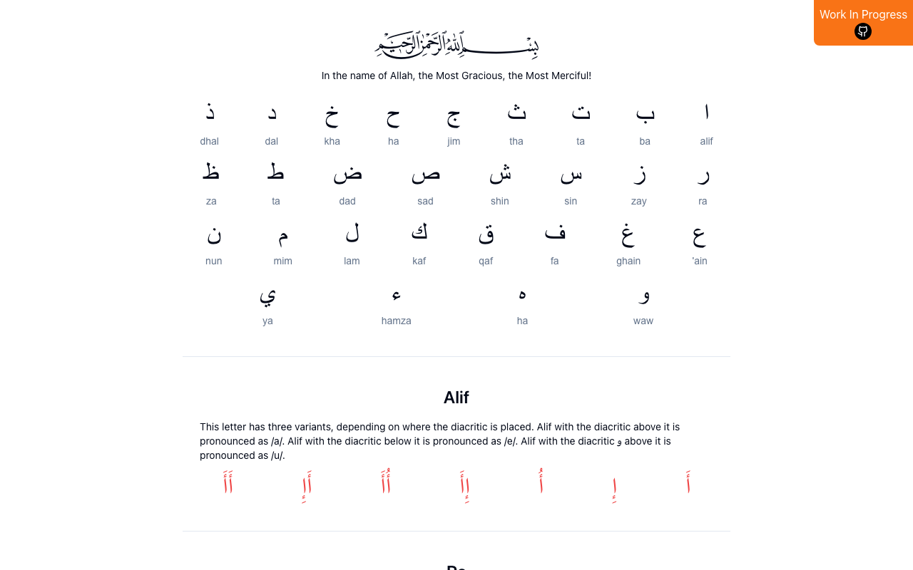

# Learning Arabic Letters

Interactive e-book for learning to read Arabic and Tajweed.

## Description

A digital learning tool that teaches Arabic reading and Quranic pronunciation rules (Tajweed) following the Muallim Sani method. Built as a static web app with an interactive book-style interface.

## Setup

```bash
npm install
npm run dev
```

Open [http://localhost:3000](http://localhost:3000) in your browser.

## Data

Lesson content is stored as JSON files in [`assets/`](assets/) — alphabet, letters with diacritics, maad (long vowels), tanween, tashdeed, and practice exercises.



## Highlighting diacritics

The e-book uses red highlighting to draw the reader's attention to specific parts of Arabic words — sometimes a letter, sometimes a vowel mark (harakat), sometimes a tanween or maad. The challenge is that in Arabic, diacritics are not separate characters you can style independently. They're Unicode combining marks that attach to the preceding letter, so you can't just wrap a fatha in a `<span>` and color it red.

### The problem

If you strip diacritics from a word and try to highlight a base letter, you lose the diacritics entirely. If you keep the full word and try to color a letter, the diacritic comes along with it. There's no way in HTML/CSS to target just the harakat or just the letter underneath — they're one glyph.

Relevant Stack Overflow threads that explored this:
- [Highlighting the word in Arabic](https://stackoverflow.com/questions/24828931/highlighting-the-word-in-arabic)
- [Partially colored Arabic word in HTML](https://stackoverflow.com/questions/11155849/partially-colored-arabic-word-in-html)
- [Highlight substring in Arabic text and ignore diacritics](https://stackoverflow.com/questions/78565279/highlight-substring-in-arabic-text-and-ignore-diacritics)

### The solution: two overlapping layers

The trick is to render the same word twice, stacked on top of each other:

1. **Background layer** (`position: absolute`, `z-index: -10`): the full word with all diacritics intact.
2. **Front layer** (`position: relative`): the word with diacritics stripped out (regex `/[\u064B-\u0652]/g`), where specific base letters are colored red.

Because the front layer has no diacritics, the red coloring only applies to the base letters. The diacritics from the background bleed through visually but stay black. Flip the coloring logic — color the diacritics in the background layer red and leave the front black — and you highlight just the harakats instead.

Each section of the book has its own word component (`word.tsx`, `word-tanween.tsx`, `word-maad.tsx`, `word-tashdeed.tsx`) with specific logic for what to highlight. For example, the tanween component looks ahead in the character array for Unicode points 1611–1613 (fathatan, dammatan, kasratan) and colors matching letters accordingly.

### Font matters

The font choice is important. Some Arabic fonts render a letter differently depending on whether it carries a diacritic — the glyph shape or spacing shifts. When you overlay a diacritic-stripped version on top of the full version, any mismatch becomes visible as color bleeding or misalignment. The project uses Arial (`font-arabic: ['Arial', 'sans-serif']`), which keeps letter shapes consistent with and without diacritics. A `WebkitTextStroke: ".15px white"` on the background layer also helps mask minor bleeding around edges.
